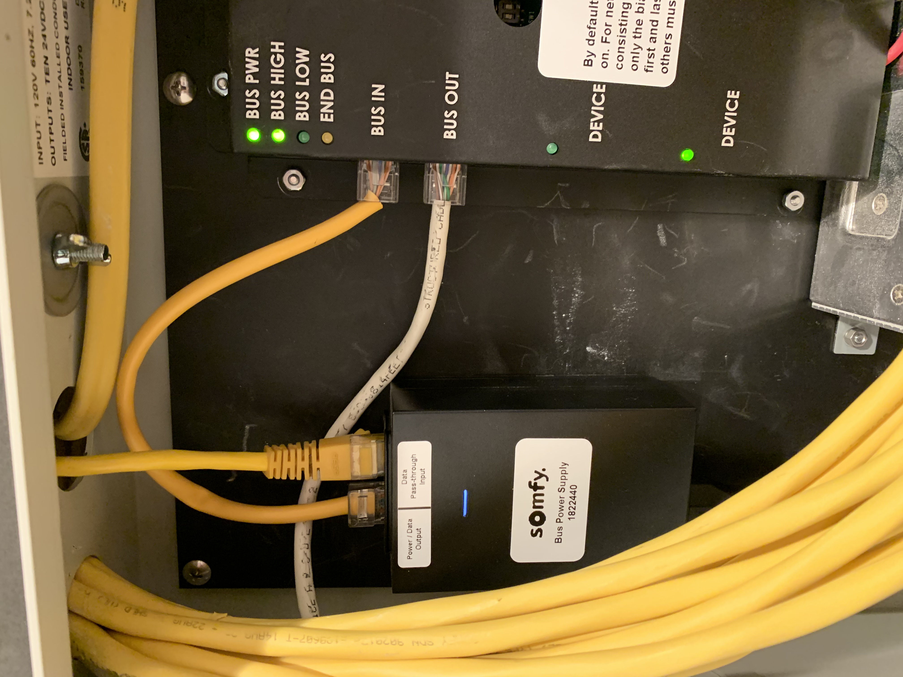
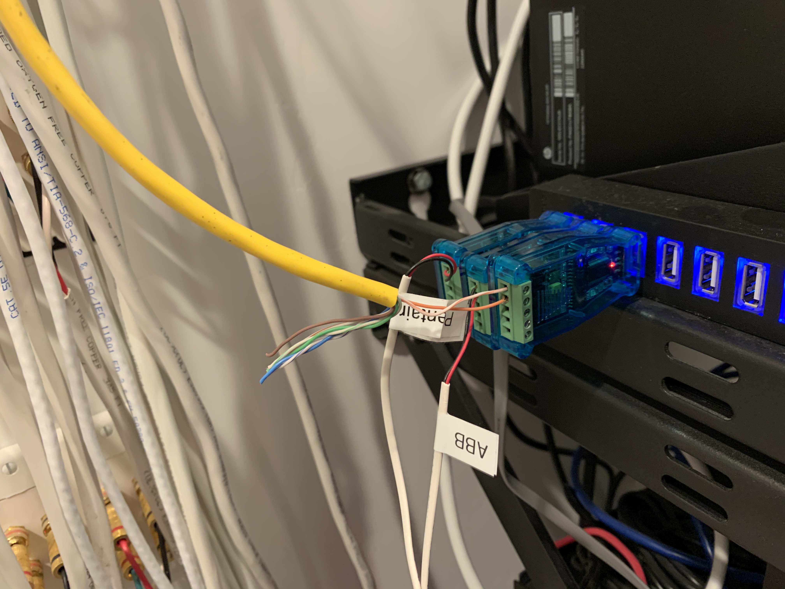

# Somfy SDN Gem

This gem is a Ruby library for interacting with Somfy RS-485 motorized shades,
primarily ST/Sonesse 30 DC models. There is very little documentation on the
protocol, and it has been further reverse engineered by various individuals,
and by capturing traffic from a Somfy UAI+, and referencing the output of the
Somfy SDN Frame Builder tool.

One caveat is for getting and setting node labels, there appears to be bugs
in the UAI+ and Sonesse 30 motors that can truncate the checksum in certain
conditions when the sum of the bytes is greater than 0x10ff. Unfortunately
they seem to be _different_ bugs in UAI+ and the motors. Therefore I've
given up on figuring out exact ranges and inferring who is sending the
message, and just don't automatically query node labels. You can still set
labels just fine via MQTT.

## MQTT/Homie Bridge

An MQTT Bridge is provided to allow easy integration with other systems. You
will need a separate MQTT server running ([Mosquitto](https://mosquitto.org) is
a relatively easy and robust one). The MQTT topics follow the [Homie
convention](https://homieiot.github.io), making them self-describing. If you're
using a systemd Linux distribution, an example unit file is provided in
`contrib/sdn_mqtt_bridge.service`. So a full example would be (once you have
Ruby installed):

```sh
gem install somfy_sdn
sudo curl https://github.com/ccutrer/somfy_sdn/raw/master/contrib/sdn_mqtt_bridge.service -L -o /etc/systemd/system/sdn_mqtt_bridge.service
<modify the file to pass the correct URI to your MQTT server, and path to RS-485 device>
sudo systemctl enable sdn_mqtt_bridge
sudo systmctl start sdn_mqtt_bridge
```

Once you have it connected and running, you'll like want to Publish `true` to
`homie/sdn/discovery/discover/set` to kick off the discovery process and find
existing motors.

Note that several properties support additional value payloads than Homie would
otherwise define in order to access additional features:

 * <node>/positionpercent: UP, DOWN, and STOP are supported to allow directly
   connecting a single OpenHAB Rollershutter item to it.
 * <node>/downlimit and <node>/uplimit also support `delete`,
   `current_position`, `jog_ms`, and `jog_pulses` in addition to a specified
   position in pulses. For the two jog options, an distance of 10 (ms/pulses)
   is assumed.
 * <node>/ip<number>pulses and <node>/ip<number>percent also support `delete`
   and `current_position`.

Other properties of note:
 * <node>/groups is a comma separated list of group addresses. Groups have
   addresses from 01.01.01 to 01.01.FF. A motor can be a member of up to 16
   groups. Be aware that if you have a UAI+ also on the network, it does
   NOT query group membership from motors, and instead keeps everything cached
   locally, so will not reflect any changes you make outside its control.
   Groups also don't have names.

## OpenHAB
If you're going to integrate with OpenHAB, you'll need to install the
`MQTT Binding` in `Add-ons`. Then go to Inbox, click `+`, select `MQTT Binding`
and click `ADD MANUALLY` near the bottom. First create a Thing for the
`MQTT Broker` and configure it to point to your MQTT server. At this point you
can create a `Homie MQTT Device`, but I don't recommend it because OpenHAB
Homie nodes as channel groups instead of individual things, and this can become
quite cluttered if you have many shades. Instead, you go for generic MQTT
things, and configure them manually.

Example Things file:
```
Thing mqtt:topic:072608 "Master Bedroom Shade" (mqtt:broker:hiome) @ "Master Bedroom"
{
  Channels:
    Type rollershutter : shade "Shade"
      [
        stateTopic = "homie/somfy/072608/positionpercent",
        commandTopic = "homie/somfy/072608/positionpercent/set"
      ]
}
```

Example Items file (including configuration for exposing to HomeKit):

```
Rollershutter MasterShade_Rollershutter "Master Bedroom Shade" [ "WindowCovering" ] { channel="mqtt:topic:072608:shade", autoupdate="false" }
```

Example Rules file for maintaining HomeKit state:

Example sitemap snippet:
```
Text label="Master Bedroom" icon=bedroom {
        Frame {
                Default item=MasterShade_Rollershutter label="Shade"
        }
}
```

## Connecting via RS-485

This gem supports using an RS-485 direct connection. It is possible to directly
connect to the GPIO on a Raspberry Pi, or to use a USB RS-485 dongle such as
[this one from Amazon](https://www.amazon.com/gp/product/B07B416CPK).
The key is identifying the correct wires as RS-485+ and RS-485-.
It's easiest to connect to the Data Pass-through port of the Bus Power Supply
using an ethernet patch cable. You'll cut off the other end, and connect pins
1 and 2 (white/orange and orange for a TIA-568-B configured cable) to + and -
on your dongle:




## Related Projects

These projects are all in various states, and may be more or less developed than this one in varying aspects.

 * https://blog.baysinger.org/2016/03/somfy-protocol.html
 * https://github.com/bhlarson/CurtainControl
